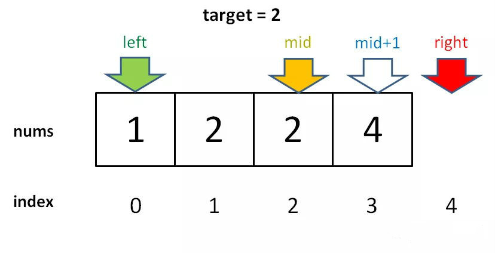

## 二分查找 binary search

- [基本二分查找](#1)
- [左边界二分查找](#2)
- [右边界二分查找](#3)  
- [总结](#4)
- [优化方式](#5)

- ## <i id="1"></i>**`基本二分查找`** 

    - **`定义`**  
    `二分查找`是一种高效的查找方式，要求线性表比赛采用`顺序存储结构`(非链式存储结构)，而且表中元素按关键字`有序排列`。 </br>

    - **`过程简单描述`**
    1. 在有序表中，取中间的记录作为比较关键字，若给定值与中间记录的关键字相等，则查找成功。</br>
    2. 若给定的值小于中间记录的关键字，则在中间记录的左半区间继续查找；若给定值大于中间记录的关键字，则在中间记录的右半区间继续查找。</br>
    3. 不断重复这个过程，直到查找成功。否则查找失败。</br>


    - **`图解`**  
    </br>  
    图片来源网络</br>

    - **`要点`**  
    1. 设立low,high,mid，作为临时存储。</br>
    2. mid = low+((high-low)>>1),不采用 (low+high) >> 1,避免 low+high 越界


    - <i id="binary_search_space"></i>**`复杂度`**      
    O(logn)  
    计算：
    总共n个元素，依次循环次数 n,n/2,n/4,n/8,....,n/(2^k),k为循环次数 `(n/(2^k) >= 1,最小需要一次 k=log2n)`  

    - **`思路`**  
    思路查看总结中 [二分查找法框架](#binary_framework) 和 [二分法查找](#binary_search)

    - **`缺陷`**  
    ```go
    var nums = []int{1,2,2,2,3}  
    var target int = 2
    index := binarySearch(nums,target)

    调用函数 binarySearch 返回 index为2 ,对于index 为 1,index 为3 无法处理
    ```  


- ## <i id="2"></i>**`寻找左侧边界的二分查找`**  
    - 可以解决缺陷中获取最左索引  
    - 思路查看总结中 [二分查找法框架](#binary_framework) 和 [左边界二分查找](#left_bound)

- ## <i id="3"></i>**`寻找右边界的二分查找`**
    - 可以解决缺陷中获取最右索引  
    - 思路查看总结中 [二分查找法框架](#binary_framework) 和 [右边界二分查找](#right_bound)


- ## <i id="4"></i>**`总结`**    

    - <i id="binary_search"></i>[二分法查找 (binary_search)](./binary_search.go)  
        - `注意1`：因为初始化   high = len(nums)-1    
        - `注意2`: 所以决定了[搜索区间] 是[low,high],所以 low <= high  
        - `注意4、5`：同时也决定了 low = mid +1 (`注意4`),high = mid - 1 (`注意5`) 
        - `注意3、6`：因为只需要找到一个 target的索引即可,所以当nums[mid] == target 时,立即返回 return mid (`注意3`), 找不到最后返回 -1 (`注意6`)  

    - <i id="left_bound"></i>[左边界二分查找 (left_bound_binary_search)](./left_bound_binary_search.go)  
        - `注意1`：因为初始化   high = len(nums)      
        - `注意2`: 所以决定了[搜索区间] 是[low,high),所以 low < high  
        - `注意4、5`：同时也决定了 low = mid +1 (`注意4`),high = mid  (`注意5`)   
        - `注意3`：因为需要找到 target的最左侧的索引,所以当nums[mid] == target 时， 
                不要立即返回,而是收紧右边界以锁定左侧边界 high = mid (`注意3`)   
        - `注意6`：找最左索引,左侧中小于target个数，就是要找的索引，即low，当查找  
                的目标元素，不再数组元素中，存在两种情况,target<nums[0],小于target 数为0，当target>nums[len(nums)-1],小于target数为len(nums),返回 -1,所以返回值为 return leftBoundReturnCmp(nums,low,target)  
                exp : var nums []int{1,2,2,4},target=0 或target=5  
                  
                图片来源网络    
        `说明`: `注意2`循环的退出条件是 low == high ，返回时的low和high相等

        ```go 
        func leftBoundReturnCmp(nums []int, low, target int) int {
            if low == len(nums) {
                return -1
            }
            if nums[low] == target {
                return low
            }
            return -1
        }
        ```

    - <i id="right_bound"></i>[右边界二分查找 (right_bound_binary_search)](./right_bound_binary_search.go)         
        - `注意1`：因为初始化   high = len(nums)      
        - `注意2`: 所以决定了[搜索区间] 是[low,high),所以 low < high  
        - `注意4、5`：同时也决定了 low = mid +1 (`注意4`),high = mid  (`注意5`)   
        - `注意3`：因为需要找到 target的最右侧的索引,所以当nums[mid] == target 时，
                  不要立即返回,而是收紧左边界以锁定右侧边界 low = mid+1 (`注意3`)

        - `注意6`：当 nums[mid] = target 时 通过`注意2`中 low= mid+1,返回 low 一定 不对，当查找的值存在时一定是 low -1,现在讨论不存在的时候,当target >nums[len(nums) - 1],大于target数为0,当target < nums[0],大于target数为len(nums),都返回 -1;`注意2`循环的退出条件是 low == high ，返回时的low和high相等,所以返回值为 return rightBoundReturnCmp(nums,high,target)

        ```go 
        func rightBoundReturnCmp(nums []int, high, target int) int {
            if high == len(nums) {
                return -1
            }
            if nums[high-1] == target {
                return high-1
            }
            return -1
        }
        ```

    <i id="binary_framework"></i>__二分查找法的框架__  

```go
func (nums []int,target int) {
    low,high := 0,... //注意1
    mid := low+((high-low)>>1)
    for ... {   //注意2
        if nums[mid] == target {
            ... //注意3
        }else if (nums[mid] < target){
            low = ... //注意4
        }else if (nums[mid] > target ){
            high = ... //注意5
        }
        mid := low+((high-low)>>1)
    }
    return ...  //注意6
}
```


- ## <i id="5"></i>**`优化方式`** 
    - [插值查找算法](../interpolation_search)  
    - [斐波那契搜索](../fibonacci_search)  


    