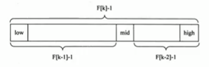

## 斐波那契搜索  fibonacci search  

https://en.wikipedia.org/wiki/Fibonacci_search_technique

- [斐波那契搜索](#1)
- [不依赖数组斐波那契搜索](#2)
- [总结](#3)

- ## <i id="1"></i>**斐波那契搜索**

    - **`定义`**  
    1. `斐波那契搜索`就是在[二分查找](../binary_search)的基础上根据斐波那契数列进行分割的。
    在斐波那契数列找一个等于略大于查找表中元素个数的数F[n]，将原查找表扩展为长度为F[n](如果要补充元素，则补充重复最后一个元素，直到满足F[n]个元素)，完成后进行斐波那契分割，即F[n]个元素分割为前半部分F[n-1]个元素，后半部分F[n-2]个元素，找出要查找的元素在那一部分并递归，直到找到。  
    2. `对F(k-1)-1的理解`  
        1. 根据公式： `F[k] = F[k-1] + F[k-2]`，得到`(F[k]-1) = (F[k-1]-1) + (F[k-2]-1) +1`  
        2. 因为有时候`顺序表长度 n` 不一定刚好等于 F[k]-1 ，将`原数组查找表扩展为长度为F[k]-1 `(如果要`补充元素`，则`补充重复最后一个元素，直到满足F[k]-1个元素`)，完成后进行`斐波那契分割`。 这里的k值只要能使得`F[k] - 1 `恰好大于或等于n即可。</br>
        3. </br> 
        如图所示,只要`顺序表的长度为 F[k]-1` 就可以分割为`前半部分F[k-1]-1]`个元素，`后半部分 F[k-2]-1 `个元素，从而确定`中间位置`为 `mid = low+F(k-1)-1`，找出要查找的元素在那一部分并递归，直到找到。

    - **`算法来源`**  
    `斐波那契查找`与[二分查找](../binary_search) 和 [插值查找](../interpolation_search)相似,仅仅是改变了mid的位置，mid不再是中间或插值得到,而是位于黄金分割点附近, mid = low + F(k-1)-1,比较结果也分为三种</br>
    </br>
    如图所示：  
    1. 相等,mid位置的元素,判断mid是否>=len(nums),若是mid = len(nums) - 1,返回</br>。 
    2.  `>` , `low = mid +1 ,k -=2 `,待查找的元素在`[mid+1,high]`,`[mid+1,high]`内的元素个数为`F(k-2)` 所以可以递归应用`斐波那契查找`</br>
    推导如下:  
    `F(k) - 1` - `((F(k-1)) - 1)` - 1 = `F(k) - F(k-1)`  = `F(k-2)` </br>
    3.  `<`,`high = mid -1 ,k-=1`,待查找的元素在 `[low,mid-1]`,`[low,mid-1]`内的元素个数为`F(k-1)-1` 所以可以递归的应用`斐波那契查找`</br>


    - **`过程简单描述`**
    1. 找到大于或等于待查找数组长度len(nums)的最小斐波那契数列长度,满足`F(k) - 1>=len(nums)`。 </br>
    ```go
    fib := fibonacci(len(nums))
    ```

    2. 以`F(k)-1`长度创建填充数组,将原待排序数组元素拷贝到填充数组中来,如果有剩余的未赋值元素,用原待排序数组的最后一个元素值填充。</br>
    ```go
    filled := getFilled(nums,k)
    ```

    3. 在[low,high]范围内,对填充数组filled进行关键字查找 。</br>
        - mid = low + fib(k) - 1
        - 比较 target 与 filled[mid]  
            - =:相等,mid位置的元素,判断mid是否>=len(nums),若是mid = len(nums) - 1,返回
            - `>` , `low = mid + 1 ,k-=2`
            - `<` , `high = mid - 1 ,k-=1`


    - **`复杂度`**      
    O(logn)  
    根据F(k) = F(k-1) + F(k-2) 展开始一颗树

- ## <i id="2"></i> **不依赖数组斐波那契搜索**
    - 参考 https://www.geeksforgeeks.org/fibonacci-search/

    - **`观察`**：  
    下面的观察用于范围消除。  
    F(n-2)约; (1/3)* F(n)和
    F(n-1)约; (2/3)* F(n)。

    - **`算法`**：
    让搜索到的元素为target。  
    1. 首先找到大于或等于给定数组长度的最小斐波那契数。令找到的斐波那契数为fib（第m个斐波那契数）。我们使用第（m-2）个斐波那契数作为索引（如果它是有效索引）。令第（m-2）个斐波那契数为i，我们将nums[i]与target进行比较，如果target相同，则返回i。否则，如果target更大，则在i之后重现子数组，否则在i之前重现子数组。
    2. 下面是完整的算法，nums 为输入数组，要搜索的元素为 target,n 为数组长度。  
    查找大于或等于n的最小斐波那契数。将该数字设为fibM [第m个斐波那契数]。设前面的两个斐波那契数为fibMm1 [第（m-1）个斐波那契数]和fibMm2 [第（m-2）个斐波那契数]。
    虽然数组具有要检查的元素：
        1. 将x与fibMm2覆盖范围的最后一个元素进行比较
        2. 如果 x匹配，则返回索引
        3. 否则，如果 target小于元素，则将三个Fibonacci变量向下移动两个Fibonacci，表示消除了剩余数组的大约三分之二。
        4. 如果 target大于元素，则将三个斐波那契变量向下移动一个斐波那契。将偏移量重置为索引。这些共同表明消除了其余阵列的大约三分之一。
    3. 由于可能还剩下一个要比较的元素，因此请检查fibMm1是否为1。如果是，则将target与该剩余元素进行比较。如果匹配，则返回索引。

- ## <i id="3"></i> **总结**    
    - `斐波那契查找`的平均性能比[二分查找](../binary_search) 好  
    - [插值查找](../interpolation_search) 只适用于关键字均匀分布的表  

