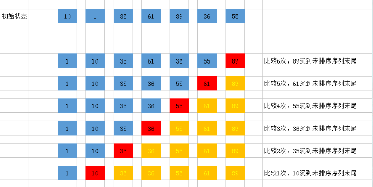

## 冒泡排序 bubble

- [上一章<<插入排序算法](../../insertion)
- [下一章>>快速排序算法](../quick)
- [定义](#1)
- [过程简单描述](#2)
- [图解](#3)
- [复杂度](#4)

- <i id="1"></i>**`定义`**  
`冒泡排序`属于一种典型的`交换排序`,`交换排序`顾名思议就是通过元素的两两比较，判断是否符合要求，如果不符合要求就交换位置来达到排序的目的。冒泡排序名字的由来就是因为在交换过程中，类似水泡，小（大）的元素经过不断的交换由水底慢慢的浮到水的顶端。  

- <i id="2"></i>**`过程简单描述`**  
1. 比较相邻的元素。如果第一个比第二个大，就交换他们两个。
2. 对每一对相邻元素做同样的工作，从开始第一对到结尾的最后一对。在这一点，最后的元素应该会是最大的数。
3. 针对所有的元素重复以上的步骤，除了最后一个。
4. 持续每次对越来越少的元素重复上面的步骤，直到没有任何一对数字需要比较。  

- <i id="3"></i>**`图解`**  
N个数字要排序完成，总共进行了N-1趟排序，每趟的排序次数为N-i次，所以可以用双重循环语句，外层控制循环多少趟，内层控制每一趟的循环次数。
要排序数组:[10,1,35,61,89,36,55]  
   
图片来源网络 

- <i id="4"></i>**`复杂度`**  
冒泡排序总的平均时间复杂度为 O(n^2)  
1. 文件的初始状态是正序的，一趟扫描即可完成排序。所需的关键字比较次数C和记录移动次数 M 均达到最小值：Cmin = n - 1,Mmin = 0 ，所以冒泡排序最好的时间复杂度为O(n)。
2. 若初始文件是反序的，需要进行 n -1 趟排序,每趟排序要进行 n-i 次关键字的比较(1<=i<=n-1),且每次比较都必须移动记录3次来达到交换记录位置。在这种情况下，比较和移动次数均达到最大值：
Cmax = n*(n-1)/2=O(n^2)
Mmax = 3*n*(n-1)/2=O(n^2)
冒泡排序的最坏时间复杂度为O(n^2)

