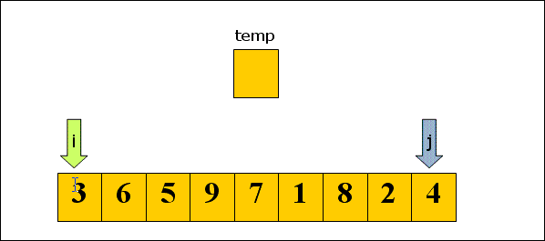
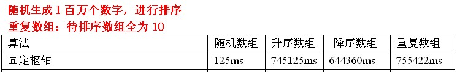
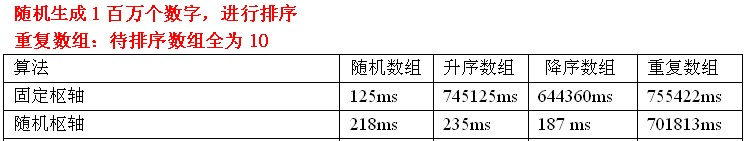
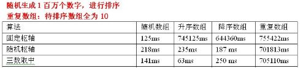
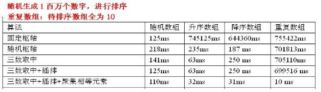
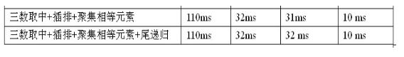
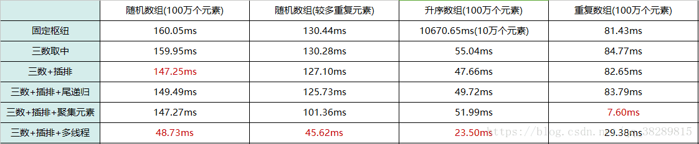

## 快速排序 quick

- [上一章<<冒泡排序](../bubble)
- [下一章>>选择排序](../../selection)
- [算法来源](#1)
- [过程简单描述](#2)
- [图解](#3)
- [复杂度](#4)
- [基准pivot(枢纽元)选取](#5)
- [划分算法](#6)
- [快排优化](#7)


- <i id="1"></i>**`算法来源`**  
    - `快速排序`也属于交换排序，是对[冒泡排序](../bubble)的一种改进。 [冒泡排序](../bubble) 在每一轮只把一个元素冒泡到数列的一端，`快速排序`在采用[分治法](../../../divide_conquer)，`每一轮挑选一个基准元素(pivot),并让其他比它大的元素移动到数列一边，比它小的元素移动到数列的另一边，从而把数列拆解成了两个部分。`
    - `快速排序`的前身是[归并](../../merge)，[归并](../../merge)的最大问题是需要额外的存储空间，并且由于合并过程不确定，致使每个元素在序列中的最终位置上不可预知的。  

- <i id="2"></i>**`过程简单描述`**  
    设当前待排序的无序区R[low..high],利用[分治法](../../../divide_conquer)可将快速排序分为：</br>
    1. 选择基准:  
        在待排序列中，按照某种方式挑出一个元素，作为基准pivot
    2. 划分操作:   
        以此基准将当前无序区划分为左、右两个较小的区间R[low..pivotpos-1]和R[pivotpos+1..high],并使左边子区间中所有记录的关键字均小于等于`基准`(pivot)记录的关键字pivot.key,右边的子区间中所有记录的关键字均大于等于 pivot.key，而基准记录 pivot 则位于正确的位置(pivotpos)上，它无须参加后续的排序。
    3. 求解(递归)   
        通过[递归调用](../../../recursion)对左、右子区间R[low..pivotpos-1]和R[pivotpos+1..high]快速排序。</br>
    4. 组合   
        因为当"求解"步骤中的两个递归调用结束时，其左、右两个子区间已有序。对快速排序而言，"组合"步骤无须做什么，可看作是空操作。</br> 

- <i id="3"></i>**`图解`**   
    1. 设置两个变量low、high，排序开始的时候low = 0，high = n-1; </br>
    2. 以第一个数组元素作为关键数据，赋值给pivot，即pivot：=A[0]; </br>
    3. 从high开始向前搜索，即由后开始向前搜索，找到第一个小于pivot的值，两者交换; </br>
    4. 从low开始向后搜索，即由前开始向后搜索，找到第一个大于pivot的值，两者交换; </br>
    5. 重复第3、4步，直到low=high; </br>
      </br>
    图片来源网络</br>


- <i id="4"></i>**`复杂度`**  
    1. `时间复杂度:` 
    平均时间复杂度 O(nlogn) ,最坏情况下的时间复杂度是O(n^2) 随机选择pivot，每一次选到数列最大值或最小值。
        - 最优: Partion每次都划分得很均匀,如果排序n个关键字，其递归树的深度为⌊logn⌋+1,（⌊x⌋表示不大于x的最大整数）,即仅需要递归logn次，需要时间T(n)。第一次Partiation应该是需要对整个数组扫描一遍，做n次比较。然后，获得的枢轴将数组一分为二，那么各自还需要T(n/2)的时间（注意是最好情况，所以是平分两半）。于是不断的划分下去，我们就有了下面的不等式推断：  
        T(n)≤2T(n/2) +n，T(1)=0  
        T(n)≤2(2T(n/4)+n/2) +n=4T(n/4)+2n  
        T(n)≤4(2T(n/8)+n/4) +2n=8T(n/8)+3n  
        ……  
        T(n)≤nT(1)+(log2n)×n= O(nlog2n)  
        - 最坏：待排序的序列为正序或者逆序，每次划分只得到一个比上一次划分少一个记录的子序列，注意另一个为空。如果递归树画出来，它就是一棵斜树。此时需要执行n-1次递归调用，且第i次划分需要经过n-i次关键字的比较才能找到第i个记录，也就是枢轴的位置，因比较次数为:  
        (n-1)+(n-2)+...+1 = n(n-1)/2 = O(n^2)

        - 平均情况:O(nlogn)  
        设枢轴的关键字应该在第k的位置（1≤k≤n）,那么  
        由数学归纳法可证明，其数量级为O(nlogn)。
    

    2.` 空间复杂度：`  
    快速排序使用[递归](../../../recursion),[递归](../../../recursion)使用栈，因此它的空间复杂度为O(logn)。  
        - 最好:递归树的深度为logn，其空间复杂度也就为O(logn)
        - 最坏:需要进行n-1递归调用，其空间复杂度为O(n)
        - 平均情况:空间复杂度也为O(logn)
    3. `稳定性：`  
        `快速排序`无法保证相等的元素的相对位置不变，因此它是不稳定的排序算法.  
    4. `快速排序`的性能在所有排序算法里面是最好的，数据规模越大快速排序的性能越优。快排在极端情况下会退化成O(n^2) 的算法，因此`假如在提前得知处理数据可能会出现极端情况的前提下`，可以选择使用较为稳定的[归并排序](../../merge)。

- <i id="5"></i>**`基准pivot(枢纽元)选取`**  
    对应[分治算法](../../../divide_conquer),当每次划分时，算法若都能分成两个等长的子序列时，那么分治算法效率会达到最大。所以基准值的选择很重要。</br>
    1. 固定位置 
        - 思想:取序列的第一个或者最后一个元素作为基准。
        - 结果:
        - 测试数据分析:
            1. 如果输入序列是随机的，处理时间是可以接受的。
            2. 如果数据已经有序时，此时的分割算法是一个非常不好的分割，因为每次划分只能使待排序序列减一,`快速排序`沦为[冒泡排序](../bubble),对于输入的数据是有序或部分有序情况相当常见的
        ```go
        func FixedPivot(nums []int)
        ```

    2. 随机选取基准 
        - 引入的原因:在待排序是部分有序时，固定选取枢轴使快排效率低下，要缓解这种情况，就引入了随机选取枢轴
        - 思想: 取待排序列中任意一个元素作为基准
        - 结果:
        - 测试数据分析:
            1. 随机化快速排序可以对于绝大多数输入数据达到O(nlogn）的期望时间复杂度。这是一种相对安全的策略，由于枢轴的位置是随机的，那么产生的分割也不会总是会出现劣质的分割。
            2. 在整个数组数字全相等时，仍然是最坏情况，时间复杂度是O(n^2) 实际上，随机化快速排序得到理论最坏情况的可能性仅为1/(2^n）。
            3. 若数组元素时随机的，使用固定基准常常优于随机基准.
    

    3. 三数取中(median-of-three)
        - 引入的原因:虽然随机选取枢轴时，减少出现不好分割的几率，但是还是最坏情况下还是O(n^2），要缓解这种情况，就引入了三数取中选取枢轴。
        - 思想:对待排序序列中low、mid、high三个位置上数据进行排序，取他们中间的那个数据作为枢轴，并用0下标元素存储枢轴。即：采用三数取中，并用0下标元素存储枢轴。
        - 结果:
        - 测试数据分析:
            1. 三数取中在处理升序数组有质的飞越。
            2. 使用三数取中选择枢轴优势还是很明显的，但是还是处理不了重复数组。
        ```go
        func MedianOfThreePivot(nums []int, low, high int) int
        func MedianOfThreePivotOptimize(nums []int, low, high int) int
        ```

- <i id="6"></i>**`划分算法`**   
    - 单向扫描
        该算法用一个循环扫描整个区间，并维护一个标志m,算法导论上也采用了这种算法。
    - 双向扫描
        - 常见双向划分: 
            1. [hoare划分](./partition_hoaare.go)
                - 思想:`先交换枢纽元，然后左右交换，最后在交换枢纽元`
                - 分割流程：
                    1. 选择枢纽元素:将枢纽元与序列中最后一个元素交换，当然同理也可以与最前面一个元素进行交换
                    2. 确定左右索引:初始的`左索引为i=low`,`右索引j=high-1`,因为枢纽元的索引为high,左索引向右检索，右索引向左索引检测。
                    3. 停止检测:当向左索引指向的元素小于枢纽元的时候，继续向右走，如果左索引指向的元素大于、或者等于枢纽元的时候就听下来。同样的，当右索引大于枢纽元的时候，继续向左走，若果右索引指向的元素小于、或者等于枢纽元的时候就停下来。(等于的时候也停止，原因在于：如果待排序元素中所有元素都是一样的，造成结果是对序列的分割及其不均匀，最终导致左半部分序列可能为空，或者右半部分序列为空，最终快速排序的时间复杂度为O(n^2))
                    4. 停止检测处理:当左右索引都停下来后，我们就要检测左右索引的关系。
                        - i`<`j:直接对其各自指向的元素进行swap后,i++,j--;
                        - i>j:整个检测终止，i指向的元素大于等于pivot,j指向的元素小于等于pivot。
                        - i=j:当i+2=j，然后对i++,j--时i==j,此时nums[i]>=pivot,nums[j]<=pivot ，即nums[i]=nums[j]=pivot ,既可以对其进行互换，也可以走i>j的处理流程。如果对其swap ，(由于两个元素是一样的 swap无法使用a=a+b,b=a-b,a=a-b;a=a^b,b=a^b,=a^b),互换完之后对i自加、对j自减，继续操作。也可以终止检测，进行下面的操作。
                    5. 交换枢纽元：此时i指向的元素大于等于pivot，如果大于pivot，那么是最左边大于pivot的元素，交换i元素和最后一个元素即枢纽元
                - 递归调用:
                    分割完后对左右部分进行递归调用，递归结束条件是当待排序元素个数小于等于1时。
            2. [挖坑填数](./partition_fill_number.go)
                - 思想:`先交换枢纽元,然后填坑`
                - 分割流程:
                    1. 选择枢纽元素:选择枢纽元，nums[high]挖成坑。
                    2. 确定左右索引:左索引 `i= low`,`右索引j=high`,i向右一定,j向左移动。
                    3. 停止检测:移动什么时候停下来？当nums[i]`<`pivot 的时候继续移动，当nums[i]=pivot不能继续了，因为继续的话当元素都一样，时间复杂度将为O(n^2),所以当nums[i]>=pivot的时候停下来；同理当j指向坑时,nums[j]<= pivot的时候停下来。
                    4. i和j各有分工,i和j有一个指向坑,另一个则移动.
                        - i或者j停下来后怎么办.当i停下来是,nums[i]这个数填到nums[j]这个坑上,这时nums[i]变成了坑,然后移动j。当i或j停下来的时候,将当前数填到另一个指向的坑。
                        - i`<`j:这时应该直接填，并对被填的索引进行自加或自减。这样可以避免当被填元素等于枢纽元时出现死循环。
                        - i = j:因为i和j都指向坑，所以应该终止检测,将暂存的枢纽元填入坑中。
                        - i > j: 在移动i和j的过程中就对i和j进行实时监测，不会出现i>j的情况。
                - 递归调用
            3. [移动枢纽元](./partition_move_pivot.go)
                - 思想:[hoare划分](./partition_hoaare.go)和挖坑填数](./partition_fill_number.go)都是将枢纽元选定后暂存一个地方(nums[high])，最后终止检测循环时，，将枢纽元放到该放的地方。并且在下一次递归调用的使用，不再考虑上一次的枢纽元，这样可以防止死循环。移动枢纽元的思想是枢纽元不再仅仅是参照对象了，还参与整个序列的分割。
                - 分割流程:
                    1. 选定一个枢纽元
                    2. 停止移动:i=low,j = high,i向右检测，j向左检测.当nums[i]`<`pivot的时候,继续移动，当nums[i]>= pivot的时候停下来；当nums[j]>pivot的时候继续移动，当nums[j]<=pivot的时候停下来.
                    3. i和j关系:
                        - i`<`j:交换两个元素，对i++,j--
                        - i=j:终止循环检测，退出循环后
                        - i>j:这时终止循环，j指向的应该是属于左半部分，i指向右半部分
                        - 当i和j都停下来后,交换nums[i]和nums[j];对i++,j--
            - 总结：
                遇到与枢纽元(pivot)相等的元素时需停下来，否则序列中元素一致时，时间复杂度将为O(n^2),这个原则也可以保证时间复杂度为O(nlogn)
    - 三路快排:
        双向扫描将整个数组分成`<`pivot，>pivot的两个部分，三路快排则是将数组分成`<`pivot，=pivot,>pivot的三个部分，当递归处理的时候,遇到=pivot的元素直接不用管,只处理`<`pivot，>pivot的元素。

                   
- <i id="7"></i>**`快排优化`**
      
    图片来源网络
    1. 序列长度达到一定大小时，使用[插入排序](../../insertion)
        - 原因:对于很小和部分有序的数组,快排不如[插入排序](../../insertion)好,当待插入排序序列的长度分割到一定大小后，继续分割的效率比[插入排序](../../insertion)要差,此时可以使用插排而不是快排.由《数据结构与算法分析》(Mark Allen Weiness所著)可知，当待排序列长度为5~20之间，此时使用插入排序能避免一些有害的退化情形。
        - 测试数据分析:
            1. 针对随机数组，使用三数取中选择枢轴+插排，效率还是可以提高一点，但是针对已排序的数组，是没有任何用处的。因为待排序序列已经是有序的，每次划分只能使待排序序列减1。此时，插排是发挥不了作用的。所以这里看不到时间的减少。另外，三数取中选择枢轴+插排还是不能处理重复数组。
    2. 聚集元素
        - 思想:在一次分割结束后，将与本次基准(pivot)相等的元素聚集在一起，在分割时，不再对聚集过的元素进行分割。
            - 具体过程:
                1. 在分割过程中与基准相等的元素放入数组两端
                2. 划分结束后，再将两端的元素移动到基准值周围。
            - 举例:
                1. 待排序序列 1 4 6 7 6 6 7 6 8 6 由三数取中可得基准下标为4的数6,转换后，待分割序列：6 4 6 7 1 6 7 6 8 6
                2. 普通过程：未对与key元素相等处理的结果
                    result = 1 4 6 6 7 6 7 6 8 6
                    下次的两个子序列为：1 4 6 和 7 6 7 6 8 6
                3. 聚集相同元素：
                    - 第一步:在划分过程中，把与key相等元素放入数组的两端
                        result: 6 4 1 6(枢轴) 7 8 7 6 6 6
                    - 第二步:划分结束后，把与key相等的元素移动到枢轴周围
                        result: 1 4 66(枢轴) 6 6 6 7 8 7
                4. 经过对比，在一次规划后，把与key相等的元素聚在一起，能减少迭代次数，效率会提高不少
        - 聚集元素思路跟三路快排很像，但[三路快排](./partition_three_way.go)效率更高,可以直接使用三路快排。
    3. 优化递归操作
        - 原因:`快速排序`和大多数[分治](../../../divide_conquer)排序算法一样，都有两次[递归](../../../recursion)调用。但是快排与[归并排序](../../merge)不同，归并的递归则在函数一开始，快排的递归在函数尾部，快排函数在函数尾部，这就使得快排代码可以实施尾递归优化。
        - 尾递归:
            - 概念：如果一个函数中所有递归形式的调用都出现在函数的末尾，`当递归调用是整个函数体中最后执行的语句且它的返回值不属于表达式的一部分时`，这个递归调用就是尾递归
            - 特点:在回归过程中不用做任何操作，这个特性特别重要，因为大多数现代的编译器会利用这种特点自动生成优化的代码。
        - 第一次递归后,low就没用了，此时第二次递归可以使用循环代替
        - 优点:如果待排序的序列划分极端不平衡，递归的深度将趋近于n,而栈的大小是很有限的，每次递归调用都会耗费一定的栈空间，函数的参数越多，每次递归耗费的空间也越多。优化后，可以缩减堆栈深度，由原来的O(n)缩减为O(logn),将会提高性能。
        - 结果:
        - 测试数据分析：
            其实这种优化编译器会自己优化，相比不使用优化的方法，时间几乎没有减少。
    4. 多线程处理快排
        - 结果：
        - 测试数据分析：
            结合了多线程的快排(三数+插排+多线程)在处理前三种数组时都有明显的提升。重复数组处理时间增加的原因是：聚集元素在处理重复数组时的表现已经很好了，因为在多线程的组合中，各个线程排完序后要合并，所以增加了(三数+插排+多线程)这一组合的排序时间。


