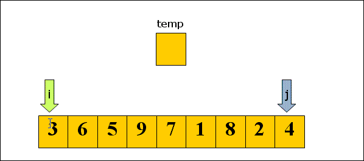
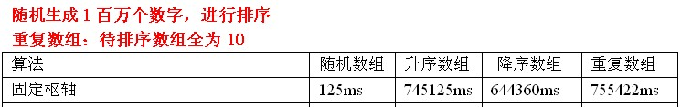
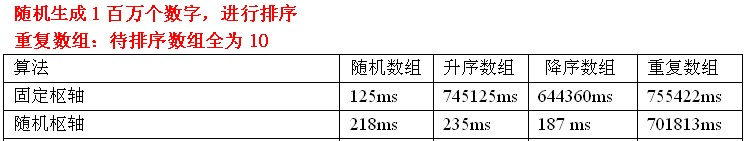
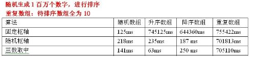
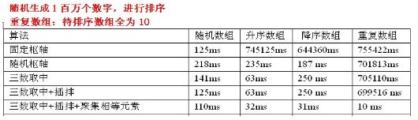

## 快速排序 quick

- [上一章<<冒泡排序](../bubble)
- [下一章>>快速排序算法](../quick)
- [算法来源](#1)
- [过程简单描述](#2)
- [图解](#3)
- [复杂度](#4)
- [基准pivot选取](#5)
- [划分算法](#6)
- [快排优化](#7)

// https://www.runoob.com/w3cnote/quick-sort.html
// https://www.jianshu.com/p/a68f72278f8f
// https://www.sohu.com/a/246785807_684445
// http://www.ayqy.net/blog/%E6%8E%92%E5%BA%8F%E7%AE%97%E6%B3%95%E4%B9%8B%E5%BF%AB%E9%80%9F%E6%8E%92%E5%BA%8F%EF%BC%88quicksort%EF%BC%89%E8%A7%A3%E6%9E%90/
// https://www.imooc.com/article/37849  
// https://wiki.jikexueyuan.com/project/data-structure-sorting/quick-sort.html 
// https://www.cnblogs.com/FdWzy/p/12288074.html
// https://blog.csdn.net/lxk2017/article/details/102779042
// https://blog.csdn.net/qq_38289815/article/details/82718428

- <i id="1"></i>**`算法来源`**
`快速排序`也属于交换排序，是对[冒泡排序](../bubble)的一种改进。 [冒泡排序](../bubble) 在每一轮只把一个元素冒泡到数列的一端，`快速排序`在采用[分治法](../../../divide_conquer)，`每一轮挑选一个基准元素(pivot),并让其他比它大的元素移动到数列一边，比它小的元素移动到数列的另一边，从而把数列拆解成了两个部分。`
`快速排序`的前身是[归并](../../merge)，[归并](../../merge)的最大问题是需要额外的存储空间，并且由于合并过程不确定，致使每个元素在序列中的最终位置上不可预知的。
基本思想:通过一趟排序将要排序的数据分割成独立的两部分，其中一部分的索引数据都比另外一部分的所有数据都要小,然后再按此方法对这两部分数据分别进行快速排序，整个排序过程可以递归进行，以此达到整个数据变成有序序列。

- <i id="2"></i>**`过程简单描述`**  
* 设当前待排序的无序区R[low..high],利用[分治法](../../../divide_conquer)可将快速排序分为： 
    1. 分解 
    在R[low..high]中任选一个记录作为基准(pivot),以此基准将当前无序区划分为左、右两个较小的区间R[low..pivotpos-1]和R[pivotpos+1..high],并使左边子区间中所有记录的关键字均小于等于`基准`(pivot)记录的关键字pivot.key,右边的子区间中所有记录的关键字均大于等于 pivot.key，而基准记录 pivot 则位于正确的位置(pivotpos)上，它无须参加后续的排序。
    2. 求解 
    通过[递归调用](../../../recursion)对左、右子区间R[low..pivotpos-1]和R[pivotpos+1..high]快速排序。 
    3. 组合 
    因为当"求解"步骤中的两个递归调用结束时，其左、右两个子区间已有序。对快速排序而言，"组合"步骤无须做什么，可看作是空操作。 
* 划分算法 Partition 
    1. 来回填坑法  
    2. 算法导论方法  
    3. 对换法    

- <i id="3"></i>**`图解`**   
1. 设置两个变量low、high，排序开始的时候low = 0，high = n-1;  
2. 以第一个数组元素作为关键数据，赋值给pivot，即pivot：=A[0];  
3. 从high开始向前搜索，即由后开始向前搜索，找到第一个小于pivot的值，两者交换;  
4. 从low开始向后搜索，即由前开始向后搜索，找到第一个大于pivot的值，两者交换;  
5. 重复第3、4步，直到low=high;  
   
图片来源网络 

- <i id="4"></i>**`复杂度`**  
1. 时间复杂度: 平均时间复杂度 O(nlogn) ,最坏情况下的时间复杂度是O(n^2) 随机选择pivot，每一次选到数列最大值或最小值。
2. 空间复杂度：快速排序使用[递归](../../../recursion),[递归](../../../recursion)使用栈，因此它的空间复杂度为O(logn)
3. 稳定性：`快速排序`无法保证相等的元素的相对位置不变，因此它是不稳定的排序算法.  
4. `快速排序`的性能在所有排序算法里面是最好的，数据规模越大快速排序的性能越优。快排在极端情况下会退化成O(n^2) 的算法，因此`假如在提前得知处理数据可能会出现极端情况的前提下`，可以选择使用较为稳定的[归并排序](../../merge)。

- <i id="5"></i>**`基准pivot选取`**  
对应[分治算法](../../../divide_conquer),当每次划分时，算法若都能分成两个等长的子序列时，那么分治算法效率会达到最大。所以基准值的选择很重要。 
1. 固定位置 
    - 思想:取序列的第一个或者最后一个元素作为基准。
    - 结果:
    - 测试数据分析:
        1. 如果输入序列是随机的，处理时间是可以接受的。
        2. 如果数据已经有序时，此时的分割算法是一个非常不好的分割，因为每次划分只能使待排序序列减一,`快速排序`沦为[冒泡排序](../bubble),对于输入的数据是有序或部分有序情况相当常见的

2. 随机选取基准 
    - 引入的原因:在待排序是部分有序时，固定选取枢轴使快排效率低下，要缓解这种情况，就引入了随机选取枢轴
    - 思想: 取待排序列中任意一个元素作为基准
    - 结果:
    - 测试数据分析:
        1. 随机化快速排序可以对于绝大多数输入数据达到O(nlogn）的期望时间复杂度。这是一种相对安全的策略，由于枢轴的位置是随机的，那么产生的分割也不会总是会出现劣质的分割。
        2. 在整个数组数字全相等时，仍然是最坏情况，时间复杂度是O(n^2) 实际上，随机化快速排序得到理论最坏情况的可能性仅为1/(2^n）。
        3. 若数组元素时随机的，使用固定基准常常优于随机基准.

3. 三数取中(median-of-three)
    - 引入的原因:虽然随机选取枢轴时，减少出现不好分割的几率，但是还是最坏情况下还是O(n^2），要缓解这种情况，就引入了三数取中选取枢轴。
    - 思想:对待排序序列中low、mid、high三个位置上数据进行排序，取他们中间的那个数据作为枢轴，并用0下标元素存储枢轴。即：采用三数取中，并用0下标元素存储枢轴。
    - 结果:
    - 测试数据分析:
        1. 三数取中在处理升序数组有质的飞越。
        2. 使用三数取中选择枢轴优势还是很明显的，但是还是处理不了重复数组。

- <i id="7"></i>**`快排优化`**
  
图片来源网络
1. 优化1:序列长度达到一定大小时，使用[插入排序](../../insertion)
    - 原因:对于很小和部分有序的数组,快排不如[插入排序](../../insertion)好,当待插入排序序列的长度分割到一定大小后，继续分割的效率比[插入排序](../../insertion)要差,此时可以使用插排而不是快排.
    - 测试数据分析:
        1. 针对随机数组，使用三数取中选择枢轴+插排，效率还是可以提高一点，但是针对已排序的数组，是没有任何用处的。因为待排序序列已经是有序的，每次划分只能使待排序序列减1。此时，插排是发挥不了作用的。所以这里看不到时间的减少。另外，三数取中选择枢轴+插排还是不能处理重复数组。
2. 聚集元素
    - 思想:在一次分割结束后，将与本次基准(pivot)相等的元素聚集在一起，在分割时，不再对聚集过的元素进行分割。
        - 具体过程:
            1. 在分割过程中与基准相等的元素放入数组两端
            2. 划分结束后，再将两端的元素移动到基准值周围。
        - 举例:
            1. 1 4 6 7 6 6 7 6 8 6 由三数取中可得基准下标为4的数6
            2. 普通过程
                - 第一趟: [7] [2] [3] [1] [6] [4] [7] [7] [7] [8] 
                - 第二趟: [1] [2] [3] [4] [6] [7] [7] [7] [7] [8]
                - 第三趟: [1] [2] [3] [4] [6] [7] [7] [7] [7] [8]
                - 第四趟: [1] [2] [3] [4] [6] [7] [7] [7] [7] [8]
            3. 聚集相同元素：
                - 第一步：[7] [7] [7] [1] [2] [4] [3] [6] [7] [8]
                - 第二步：[6] [3] [4] [1] [2] [7] [7] [7] [7] [8]

