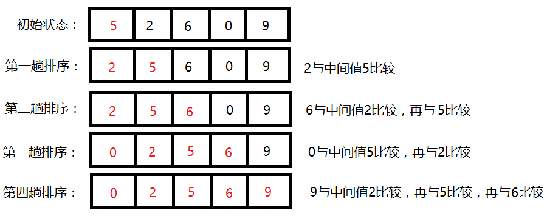

## 折半插入排序 binary insertion

- **`定义`** 
折半插入算法是对[直接插入排序算法](../straight_insertion)的改进，排序原理同[直接插入排序算法](../straight_insertion)，先折半查找元素的应该插入的位置 `high + 1`,后统一移动应该移动的元素`(high+1,i]`,最后将元素插入到`high+1`位置。  

- **`过程简单描述`**
1. 从数组第2个元素开始抽取元素。 
2. 把它与左边已经排序好的数组的中间元素进行比较,如果中间元素比它小，那么插入元素属于前半部分,否则属于后半部分,依次不断缩小范围,确定要插入的位置。 

- **`图解`**  
   
图片来源网络 

- **`要点`**  
1. 设立变量low = 0,high = i - 1 = preindex (为[直接插入](../straight_insertion/straight_insertion)的`preindex`),在区间内`[low,high]`通过[二分查找法](../../search/binary_search)获取`high` 则区间`[0,high]`都比待比较元素小。 
2. 统一向后移动`(high+1,i]`。 

- **`复杂度`**      
O(n^2)  
计算：
1. `折半插入算法`排序执行了 n 次[二分查找](../../search/binary_search)次数,[二分查找时间复杂度](../../search/binary_search#binary_search_space)为logn,所以折半算法的时间复杂度比[直接插入排序算法](../straight_insertion)时间复杂度减少了 nlogn  
2. `折半插入算法`比[直接插入排序算法](../straight_insertion)只是减少了比较次数,但元素的移动次数不变，时间复杂度O(n^2)。