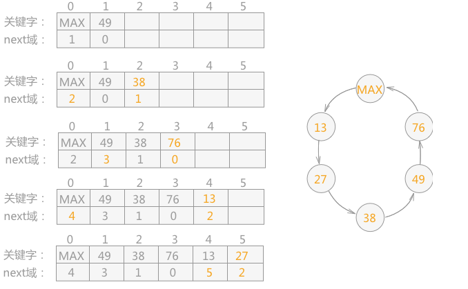
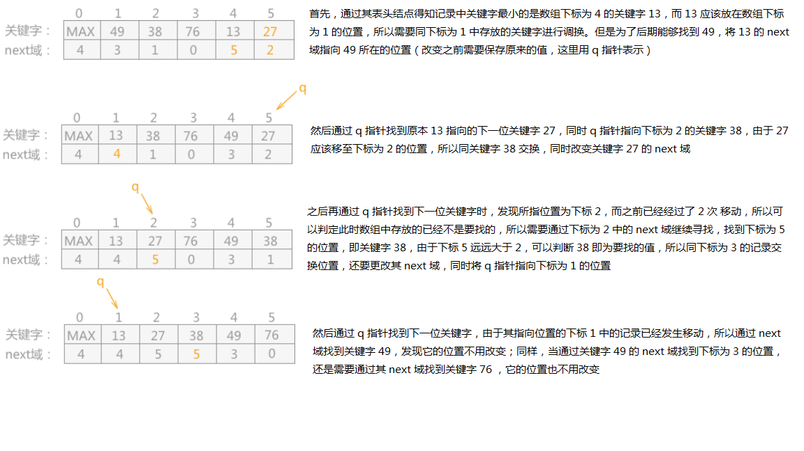

## 表插入排序 link insertion

- [上一章<<2-路插入排序算法](../two-path_insertion)
- [下一章>>希尔排序算法](../shell)
- [定义](#1)
- [算法来源](#2)
- [过程简单描述](#3)
- [图解](#4)
- [复杂度](#5)

- ## <i id="1"></i>**`定义`**
`表插入排序算法`,使用[链表](../../../../data_structure/linkedlist)的存储结构对数据信息插入排序。在对记录按照其关键字进行排序的过程中,不需要移动记录的存储位置,只需要更改结点间指针的指向。</br>

- ## <i id="2"></i>**`算法来源`**
前面介绍的三种插入排序算法[直接插入排序](../straight_insertion),[折半插入排序](../binary_insertion),[2-路插入排序](../two-path_insertion),其基本结构都采用`数组`的形式进行存储，因而无法避免排序过程中产生的数据移动的问题,如果想要从根本上解决只能改变数据的存储结构，改用[链表](../../../../data_structure/linkedlist)存储。 </br>

- ## <i id="3"></i>**`过程简单描述`** 
在使用[数组](../../../../data_structure/array)结构表示的[链表](../../../../data_structure/linkedlist)中,设定数组下标为0的结点作为链表的表头结点，并令其关键字取最大整数。
则`表插入排序`的具体实现过程是：
1. 设定数组下标为0的结点作为链表的表头结点，并令其关键字取最大整数。
2. 首先将链表中数组下标为1的结点和表头结点构成一个[循环链表](../../../../data_structure/linkedlist/circular_linkedlist)。
3. 将后续的所有结点按照其存储的关键字的大小，一次插入到循环链表中。

    |     |    |     |    |      |      |    |     |   
    ----  |----| ----|----| ---- | ---- |----|-----|
    |     | 0  | 1   | 2  | 3    | 4    | 5  | 
    关键字| MAX|     |    |      |      |     |     
    next域 | 1 | 0   |    |      |      |    |  
   思路跟[静态链表](../../../../data_structure/linkedlist/static_linkedlist)很像   </br>
4. 根据next域信息调整表结构中的数组，是数据从小到大排列。


- ## <i id="4"></i>**`图解`**  
将无序表{49，38，76，13，27}用表插入排序的方式进行排序，其过程为:
```go
func Init(nums []int) NodeList
func (nl NodeList) sort()
```
</br> 

在`表插入排序算法`求得的有序表是用链表表示的，也就注定其只能进行顺序查找。而如果想用折半查找的算法，就需要对链表进行再加工，即对链表中的记录进行重新排列，具体做法为：遍历链表，将链表中第 i 个结点移动至数组的第 i 个下标位置中。
```go
func (nl NodeList) arrange()
```
</br>
图片来源网络</br>


- ## <i id="5"></i>**`复杂度`**        
O(n^2)  
从`表插入排序`的实现过程分析，与[直接插入排序](../straight_insertion)相比只是避免了移动记录的过程（修改各记录结点中的指针域即可），插入过程中与其它关键字的比较次数并没有改变，
所以表插入排序算法的时间复杂度仍然是O(n^2) 