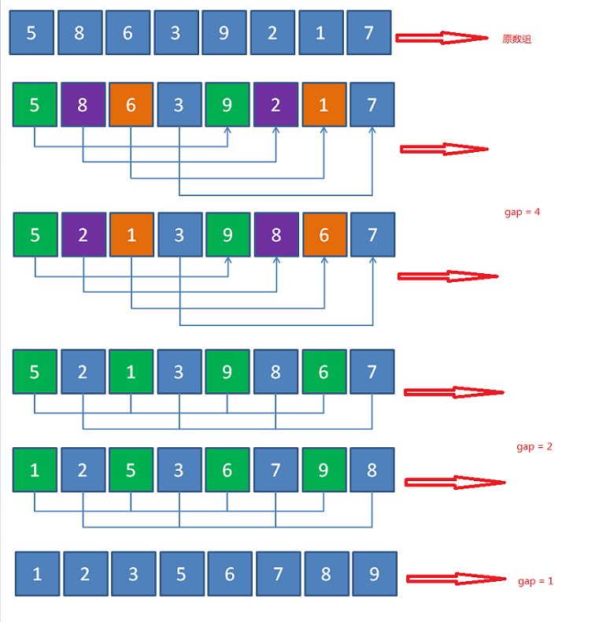

## 希尔排序 shell

- [上一章<<表插入排序](../link_insertion)
- [下一章>>交换排序](../../exchage)
- [定义](#1)
- [算法来源](#2)
- [过程简单描述](#3)
- [图解](#4)
- [关于增量](#5)
- [复杂度](#6)

- ## <i id="1"></i>**`定义`**
`希尔排序`,它是针对`直接插入排序算法`的改进。该方法又称最小增量排序 

- ## <i id="2"></i>**`算法来源`** 
`希尔排序`是基于插入排序的以下两点性质而提出改进方法的：
1. 插入排序在对几乎已经排好序的数据操作时，效率高,即可以达到线性排序的效率。
2. 但插入排序一般来说是低效率的，因为插入排序每次只能将数据移动一位。

- ## <i id="3"></i>**`过程简单描述`**  
`希尔排序`实质上是一种分组插入方法。它的基本思想是:对于n个待排序的数列，取一个小于n的整数gap(gap被称为步长)将待排序元素分成若干个组子序列，所有距离为gap的倍数的记录放在同一个组中;然后,对各组内的元素进行直接插入排序。这一趟排序完成之后，每一个组的元素都是有序的。然后减小gap的值，并重复执行上述的分组和排序。重复这样的操作，当gap=1时，整个数列就是有序的。

- ## <i id="4"></i>**`图解`**  

图片来源网络

- ## <i id="5"></i>**`关于增量`**  
常用增量有 n/2(希尔增量)、n/3、2^k-1(hibbard增量)等，实际使用中稍微改版增量也可能使排序的性能产生很大的波动。

- ## <i id="6"></i>**`复杂度`**
1. 增量序列为 Dm=⌊N/2⌋,Dk=⌊Dk+1/2⌋(原始希尔排序) 最坏时间复杂度O(n^2)
2. Hibbard增量序列  Dk=2^k−1   最坏时间复杂度为O(N^(3/2))；平均时间复杂度约为O(N^(5/4))
3. Sedgewick增量序列 D=9∗4^i−9∗2^i+1或4^i−3∗2^i+1  最坏时间复杂度为O(N^(4/3))；平均时间复杂度约为O(N^(7/6))
