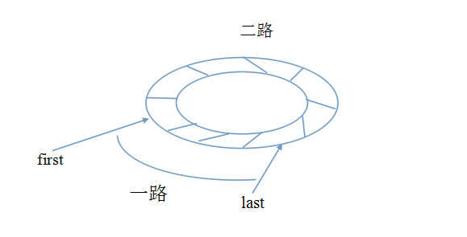

## 2-路插入排序 2-path insertion

http://qikan.cqvip.com/Qikan/Article/Detail?id=44696027
- [2-路插入排序算法-循环数组法](#1)
- [2-路插入排序算法-非循环数组法](#2)

- ## <i id="1"></i>**`2-路插入排序算法-循环数组法`**
    - **`定义`**  
    `2-路插入排序算法`是在[折半插入排序](../binary_insertion)的基础上对其进行改进,减少其在排序过程中移动记录的次数从而提高效率。</br>


    - **`过程简单描述`**  
    1. 构建一相同大小的`循环数组temp`,把原数组的元素依次。</br>
        1. 把原数组第一个值nums[0]赋值给temp[0],即temp[0] = nums[0],作为循环数组的第一个数,当然也可以选择其它的数作为第一个数。定义变量`first,final,n:=0,0,len(nums)`,`first,final` 作为temp数组最小/最大值索引。</br>
        2. 待插入元素比最小元素小,`nums[i] `<` temp[first]`,变化`first`和`temp[first]`, `first = (first -1 + n)%n`,`temp[first] = nums[i] `。</br>
        3. 待插入元素大于等于最大元素大, `nums[i] `>=` temp[final]`,变化`final`和`temp[last]`,由于last 不会超过n-1,所以`last = (last+1+n)%n = (last+1)%n = last++`, `temp[last]=nums[i]`。</br>
        4. 待插入元素大于等于最小元素,小于最大元素，即 temp[first]`<=` nums[i] && nums[i] `<` temp[last],则temp在[first,last]区间元素都是有序的,选择适当的策略插入。</br> 
            1. [直接插入排序算法](../straight_insertion)  

            ```go
            twoPathInsertionStraight(nums)
            ```

            2. [折半插入排序算法](../binary_insertion)

            ```go
            twoPathInsertionBinary(nums)
            ```

    2. 最后按合适次序赋值回原数组。</br>  

    - **`算法来源`**  
      
    图片来源于网络  
    first,last 分别指向已经排序好序列的第一个,最后一个, temp[first] `<=` nums[i] `<` temp[last]，则 nums[i]应插入一路位置,其它插入二路。

    - **`复杂度`**  
    2-路插入排序相比于折半插入排序，只是减少了移动记录的次数，没有根本上避免，所以其时间复杂度仍为O(n2)。


- ## <i id="2"></i>**`2-路插入排序算法-非循环数组法`**
    - **`算法来源`**  
    
    图片来源网络  
    该算法无序构建循环数组,`空间复杂度`由原来的O(n)降低为O(1),`时间复杂度`与`2-路插入排序算法-循环数组法`相同。 

    - **`过程简单描述`**  
    1. nums 前后形成前部，后部有序列表，简单做法是nums[0]和nums[n-1] 较小者存入nums[0],较大者存入nums[n-1]。
    2. `fstart=fend = 0` 为前半部分有序表的开始位置和结束位置;`rstart=rend=n-1` 为后半部分有序表的开始位置和结束位置。
    3. 对于索引 1`->`n-2，i,j := 1,n-2, 对nums[i]与nums[rstart] 比较大小，小于的插入前半部分,其它插入后半部分。
    4. 对于索引区间[1,n-2]每次插入数据时，可以采用适当策略。
        1. [直接插入排序算法](../straight_insertion)

        ```go
        twoPathInsertion2(nums)
        ```

        2. [折半插入排序算法](../binary_insertion)
        
        ```go 
        twoPathInsertioBinary2(nums)
        ```


