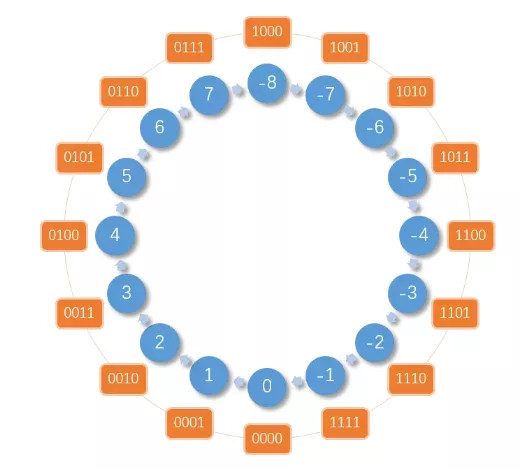
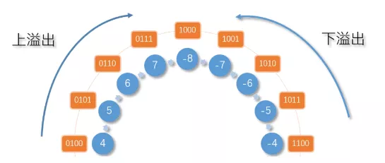
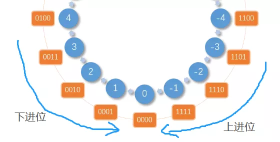

## 常见二进制操作

### 字长
1. 二进制位叫机器字长

### 整型数在计算机中，使用补码来表示。

### 一、原码
1. 原码= 符号位 + 真值  
    [+5](原码) = 0000 0101  
    [-5](原码) = 1000 0101  
    在进行原码加减法运算时，首先判断两个数的符号，同号相加，异号相减。在做减法前，先判断两个数绝对值的大小，然后用大数减去小数，最后再确定差的符号

### 二、反码
1. 符号位不动，原码取反
2. 正数的反码与其原码相同；负数的反码是对其原码逐位取反，但符号位除外
    - 用反码来计算 1 - 1  
    1 - 1   
    = 1 + (-1)   
    = [0000 0001](原) + [1000 0001](原)   
    = [0000 0001](反) + [1111 1110](反)     
    = [1111 1111](反)   
    = [1000 0000](原)  
    = -0  
3. 反码的符号位相加后，如果有进位出现，则要把它送回到最低位去相加（`循环进位`）
    - 用反码来计算 2 - 1   
    2 - 1  
    = 2 + (-1)  
    = [0000 0010](原) + [1000 0001](原)  
    = [0000 0010](反) + [1111 1110](反) + [0000 0001](循环进位)  
    = [0000 0001](反)  
    = [0000 0001](原)  
    = +1  

### 三、补码
1. 正数的补码与原码相同，负数的补码等于其反码的末位加 1
2. 补码运算时，其符号位与数值部分一起参加运算
3. 补码的符号位相加后，如果有进位出现，要把这个进位舍去（自然丢失）
    2 - 1  
    = 2 + (-1)  
    = [0000 0010](原) + [1000 0001](原)   
    = [0000 0010](反) + [1111 1110](反)  
    = [0000 0010](补) + [1111 1111](补)  
    = [0000 0001](补)  
    = [0000 0001](原)  
    = +1  
4. 整型数在计算机中，使用补码来表示

### 四、溢出
1. 符号位和数值最高位只有其中一个发生了进位了进位就为溢出
    - 计算 127 + 1 的值（在字长为 8 的机器中）
    1 + 127  
    = [0000 0001]原 + [0111 1111]原  
    = [0000 0001]补 + [0111 1111]补  
    = [1000 0000]补  
    可以发现这个数的符号位没有发生进位，但是数值最高位发生了进位

    - 计算 2 - 1 的值
    2 -1  
    = 2 + (-1)  
    = [0000 0010]原 + [1000 0001]原  
    = [0000 0010]补 + [1111 1111]补  
    = [0000 0001]补 = [0000 0001]原  
    = +1  
    这个表达式符号位和数值最高位发生了进位，但是结果却是正确的

### 五、补码与模的关系
1. 在模的范围内做减法，可以将 X - Y 的减法变更为 X + Y 的补数 的加法。那么就得出一个结论：在计算机中，负数的表达方式就是它绝对值的补数
    时钟: 2 点钟,想要将时间调到 10 点钟的话
    - 逆时针将时针转动 4 小时
    - 顺时针将时针转动 8（12 - 4） 小时  
    [-3] = [1011](原) = [1100](反) = [1101](补)  
    [13] = [1101](原) = [1010](反) = [1011](补)   
    -3 的绝对值的补数为：16 - 3 = 13

    13 已经用于表示正数的 13 了，现在又要用来表示负数的 -3，这就产生了混淆。  
      
    4 字长的二进制表示的正数与负数的范围，即正数的范围：[0 ~ 7]，负数的范围：[-8 ~ -1]，负数和正数整好各占一半。
    溢出临界区和进位临界区了。例如：7 + 1 = 8 ，可以从上图中看到， 7 顺时针的下一位是 -8，而正确答案应该是 8，所以发生了溢出。再有：-1 + 1 = 0 ，从上图中看到， -1 顺时针的下一位为 0，且正确答案正好为 0，所以发生了进位.  
      
      

### 六、位运算奇淫技巧
1. 判断一个数的奇偶性 `n & 1`
2. 利用或操作 `|` 和空格将英文字符转换为小写
3. 利用与操作 `&` 和下划线将英文字符转换为大写
4. 利用异或操作 `^` 和空格进行英文字符大小写互换
5. 利用 `^` 判断两个数是否异号
    - 利用的是补码编码的符号位
    - 避免了使用 `if-else` 或乘法 (可能导致溢出,大数相乘)
6. 利用 `^` 交换两个数   
    a= a^b  
    b= a^b = (a ^ b ) ^ b = a ^ b ^ b = a ^ 0 = a  
    a= a^b = (a ^ b ) ^ a = a ^ a ^ b = b  
  
    原理是 a^0=a a^a=0  

7. 利用`n & (n-1)` 移除最后一个1   
    比如： 0B1000&(0B1000 - 1) = 0 ,0B1010 & (0B1010-1) = 0B1000
    运用：判断一个整数是不是2的指数   
    - 移除了最后一个1 如果等于0,一个数如果是 2 的指数，那么它的二进制表示一定只含有一个1
      2^0 = 1 = 0b0001
      2^1 = 2 = 0b0010
      2^2 = 4 = 0b0100
8. 利用 `(n & (n-1))^n` 获取最后一个1
9. 汉明权重 计算整数n中比特1的个数
    - 位移实现 `>>`
    - `n & (n-1)`

### 七.二进制运用
1. singleNumber 给定一个**非空**整数数组，除了某个元素只出现一次以外，其余每个元素均出现两次。找出那个只出现了一次的元素。  
   a=0^a=a^0  
   0=a^a  
   c^a^a^b^b^d^d = c  

2. singleNumber2  给定一个**非空**整数数组，除了某个元素只出现一次以外，其余每个元素均出现了三次。找出那个只出现了一次的元素。三次可以改成n次,    可扩展     
   统计各个位1的数量    
    a=b=c=15 d= 2  
    a=1111  
    b=1111  
    c=1111  
    d=0010  
    ------  
统计1：       
      3343  
%3     
      0010  

