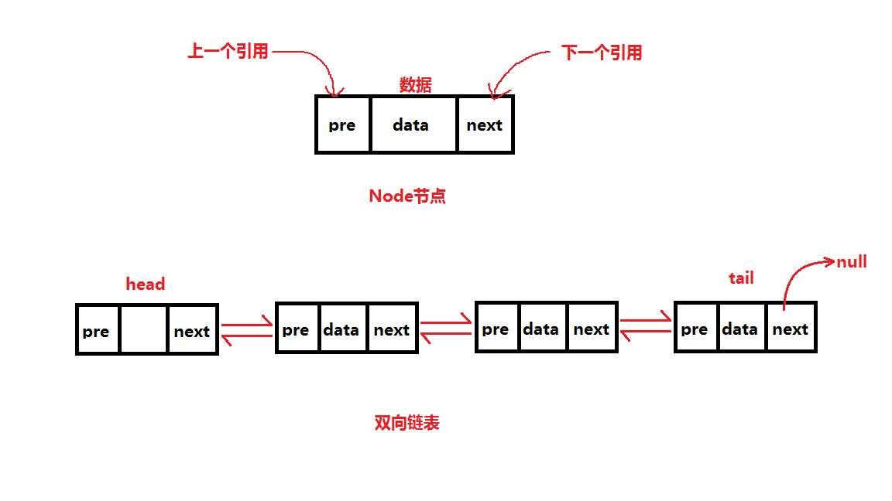

## 双向链表 double linkedlist  

- [上一章<<单向链表](../single_linkedlist)
- [定义](#1)
- [特点](#2)

- ## <i id="1"></i>**`定义`** 
`双向链表`是`链表`的一种,和[单向链表](../single_linkedlist)一样,`双向链表`也是由结点组成。它的每个数据结点中都有两个指针域，分别指向直接后继和直接前驱。  
  
图片来源于网络  

- ## <i id="2"></i>**`特点`**  
1. 除`头结点`和`尾结点`两个结点外,其它任意结点都可以通过next,pre分别指向前驱后续结点。
2. `头结点`前驱结点为空，同理尾部结点后置结点为空。
3. 可以双向遍历,查找方向可以向前或者向后。
4. 可以自我删除，单向链表不能自我删除需要靠辅助结点。
