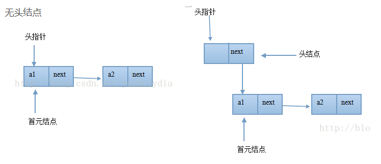

## 单向链表 single_linkedlist

- [定义](#1)
- [链表的常见操作](#2)
- [单向链表实现](#3)
    - [带头结点单向链表](#31)
    - [不带头结点单向链表](#32)
- [缺点](#4)

- ## <i id="1"></i>**`定义`**  
`单向链表`是`链表`的一种，特点是`链表`的链接方向是单向的,`链表`的访问要通过顺序读取从头部开始。  
由各个内存结构通过一个next指针链接组成,每个内存结构都存在后续内存结构【链尾除外】,内存结构由`数据域`和`next指针域`组成。 

- ## <i id="2"></i>**`链表的常见操作`**  
    1. 判断是否为空的单链表
    2. 单链表的长度
    3. 插入元素 
        1. 从头部插入元素
        2. 从尾部插入元素
        3. 从中间指定位置插入元素
    4. 删除元素
        1. 删除指定元素
        2. 删除指定位置元素
    5. 查看是否包含某个元素
    6. 遍历所有元素

- ## <i id="3"></i>**单向链表实现`**     
  
图片来源网络  
1. `头指针` 指向单向链表的第一个结点的指针,如果单向链表有头结点，则头指针指向头结点,如果单向链表没有头结点，则头指针指向首元结点。
2. `首元结点` 单向链表中第一个有元素的结点。如果单向链表有`头结点`,则`首元结点`为`头结点`的下一个结点,如果单向链表没有`头结点`,则首元结点就是`单向链表`的第一个结点。  
3. `头结点` 在单向链表第一恶元素结点之前设置一个结点,数据域可以不存放任何信息,指针域指向单向链表第一个元素的结点，对于单向链表来说,头结点可有可无,但为了操作方便，一般情况下单向链表都具有头结点。  
 

    - <i id="31"></i>[带头结点单向链表](./single_linkedlist.go)   
        1. 有一个`头结点`,没有值域,只有连域，专门存放`首元结点`的地址 
        2. 有一个尾结点,有值域，也有连域，连域值始终为null
        3. 有了`头结点`，`首元结点`为链表的第二个结点,使得所有的元素结点的添加删除具有统一性,减少程序复杂性。
    - <i id="32"></i>[不带头结点单向链表](./single_linkedlist2.go)
        1. 有一个`首元结点`head,有域值,有连域   
        2. 有一个尾结点,有值域，也有连域，连域值始终为null
        3. 没有`头结点`,删除或添加元素需要判断一次`首元结点`

- ## <i id="4"></i>**`缺点`**  
单链表中为找第i个结点或数据元素，必须先找到第i - 1 结点或数据元素，而且必须知道头结点，否者整个链表无法访问。   