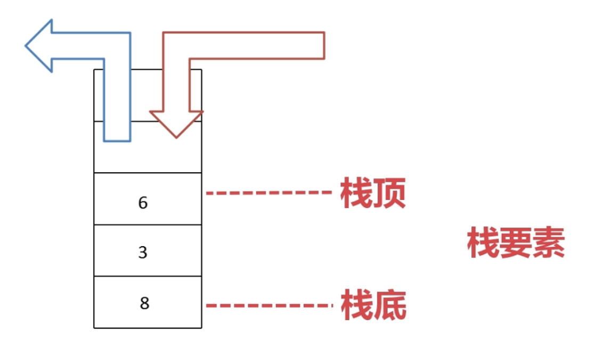

## 栈 stack

- [定义](#1)
- [基本特点](#2)
- [栈实现](#3)
- [栈的应用](#4)
- [栈相关算法](#5)


- ## <i id="1"></i>**`定义`**
栈是一种运算受限的线性表，其限制是指只仅允许在表的一端进行插入和删除操作，这一端被称为`栈顶`（Top），相对地，把另一端称为`栈底`（Bottom）。把新元素放到栈顶元素的上面，使之成为新的栈顶元素称作`进栈、入栈或压栈`（Push）；把栈顶元素删除，使其相邻的元素成为新的栈顶元素称作`出栈`或`退栈`（Pop）。这种受限的运算使栈拥有`“先进后出”`的特性（First In Last Out），简称FILO。

- ## <i id="2"></i>**`基本特点`**  
1. 在栈中，元素的添加和删除操作只能在表的一端进行，即栈顶。
2. 元素的添加和删除遵循“后进先出”（LIFO）的原则，最后添加的元素总是最先出栈
3. 栈对元素的访问加以限制，仅仅提供对栈顶元素的访问操作

- ## <i id="3"></i>**`栈实现`**  
在栈中,当栈有新元素加入时，将元素放入栈中，同时将栈顶top值加一，使其始终指向栈顶，当元素出栈时，栈顶top值减一，使其继续指向栈顶，直到top值为-1时，栈为空。
  
图片来源于网络
栈的实现方式:
1. 顺序栈(数组)
    - 栈由简单数组实现
    - 栈由动态数组实现
2. 链式栈(单向链表、双向链表或循环链表)

- ## <i id="4"></i>**`栈的应用`** 
1. 进制转换
   ```go
   func DecimalToAny(src int, baseType int)
   ```
2. 平衡符号
    ```go
    func BalanceSymbol(s IStack, chars []rune) bool
    ```


- ## <i id="5"></i>**`栈相关算法`**  
1. 栈排序  
    - 方法:使用一个辅助栈完成原始栈的排序,栈顶到栈底从大(小)到小(大)。
    - 分析: 类似[汉诺塔]()问题,元素需要在原始栈和辅助栈之间来回出栈、入栈。首先将元素栈中元素出栈，然后条件性压入辅助栈，当新出栈元素不满足压入辅助栈条件时，可以考虑将辅助栈中元素出栈，重新压入原始栈，以此完成辅助栈中元素顺序的调换。
    - 思路:待排序栈标价为Stack，辅助栈的标记为SortedStack.首先，Stack栈的栈顶元素（标记为curElement）出栈，然后尝试将其压入SortedStack栈，但需要遵从以下限制：
        1. SortedStack栈为空，直接压入；
        2. SortedStack栈非空，且curElement <= SortedStack.peek()，将curELement压入；
        3. SortedStack栈非空，但curElement > SortedStack.peek()，此时需要持续弹出SortedStack栈的顶元素直至元素curElement <= SortedStack栈最新的顶元素
        4. 通过node结点增加min元素，入栈时条件性判断是否加入
2. 最小栈实现
    - 要求:获取最小元素功能的时间复杂度O(1)
    - 分析:在O(1)时间复杂度获取一个序列极值的数据结构：有序数组，哈希表，最大(小)堆。
           我们可以尝试构造上面提及的三种数据结构来实现最小元素获取功能，但这个“构造的过程”明显会引入额外的时间复杂度。
    - 思路:基于上述两方面分析，结合元素进栈/出栈操作，这里我们尝试采用一个辅助栈(MinStack)配合原始栈(MainStack)实现算法        
           需要的新特性。其时间复杂度为O(1)，空间复杂度为O(n)。
        - 元素进栈操作:
            1. 辅助栈MinStack为空
                元素首先压入原始栈MainStack，而后直接压入辅助栈MinStack。
            2. 辅助栈MinStack非空
                元素首先压入原始栈MainStack，而后判断该元素是否需要压入辅助栈MinStack。
                此时分以下两种情况：
                - 新入栈元素大于辅助栈栈顶元素。该元素不会被压入辅助栈。
                - 新入栈元素小于等于辅助栈栈顶元素。该元素需要被压入辅助栈。
        - 元素出栈操作:
            出栈操作相对简单：首先弹出原始栈的栈顶元素，当该栈顶元素等于辅助栈的栈顶元素时，弹出辅助栈的栈顶元素，以此来保证辅助栈的栈顶元素永远是原始栈当前元素中最小的元素。

3. 用栈实现队列
4. 递归实现一个栈的逆序


