## 树 tree

- [简介](#1)
    - [定义](#11)
    - [术语](#12)
    - [种类](#13)
        - [满二叉树](./full_binary_tree)
        - [完全二叉树](./complete_binary_tree)
        - [二叉搜索树/二叉搜索树](./binary_search_tree)
        - [平衡二叉搜索树](./avl_tree)
        - [伸展树/分裂树](./splay_tree)
        - [线段树](./segment_tree)
        - [红黑树](./red_black_tree)
        - [霍(哈)夫曼树](./huffman_tree)
        - [字典树/前缀树](./trie_tree)
        - [基数树/压缩前缀树](./radix_tree)
        - [三分搜索树](./ternary_search_tree)
        - [B Tree/平衡多路搜索树](./b_tree)
        - [B+ Tree](./b+_tree)
        - [B* Tree](./b_star_tree)
- [存储结构](#2) 

//https://blog.csdn.net/baichoufei90/article/details/84788524
//https://www.cs.usfca.edu/~galles/visualization/Algorithms.html
//http://data.biancheng.net/tree/
//https://www.cnblogs.com/jiangxin/p/11810772.html
// https://blog.csdn.net/u014532217/article/details/79118023

- <i id="1"></i>**`简介`**   
    - <i id="11"></i>定义:  
        树（tree）是包含n（n>=1）个结点，(n-1)条边的有穷集
        1. 每个元素称为结点（node）；
        2. 有一个特定的结点被称为根结点或树根（root）
        3. 除根结点之外的其余数据元被分为m（m≥0）个互不相交的集合T1，T2，……Tm-1，其中每一个集合Ti（1<=i<=m）本身也是一棵树，被称作原树的子树（subtree）
    - <i id="12"></i>术语:
        1. 节点深度：对任意节点x，x节点的深度表示为根节点到x节点的路径长度。所以根节点深度为0，第二层节点深度为1，以此类推
        2. 节点高度：对任意节点x，叶子节点到x节点的路径长度就是节点x的高度
        3. 树的深度：一棵树中节点的最大深度就是树的深度，也称为高度
        4. 父节点：若一个节点含有子节点，则这个节点称为其子节点的父节点
        5. 子节点：一个节点含有的子树的根节点称为该节点的子节点
        6. 节点的层次：从根节点开始，根节点为第一层，根的子节点为第二层，以此类推
        7. 兄弟节点：拥有共同父节点的节点互称为兄弟节点
        8. 度(degree)：节点的子树数目就是节点的度
        9. 叶子节点：度为零的节点就是叶子节点
        10. 祖先：对任意节点x，从根节点到节点x的所有节点都是x的祖先（节点x也是自己的祖先）
        11. 后代：对任意节点x，从节点x到叶子节点的所有节点都是x的后代（节点x也是自己的后代）
        12. 森林：m颗互不相交的树构成的集合就是森林
    - <i id="13"></i>种类:
        - `无序树`：
            树中任意节点的子结点之间没有顺序关系，这种树称为无序树,也称为自由树;
        - `有序树`：
            树中任意节点的子结点之间有顺序关系，这种树称为有序树；
        - `二叉树`：  
            每个节点最多含有两个子树的树称为二叉树；
            1. 二叉树的第i层上节点数最多2^(i-1)
            2. 高度为k的二叉树中，最多有2^(k-1)个节点
            3. n0表示度为0的结点数，n1表示度为1的结点，n2表示度为2的结点数。在二叉树中：n0=n2+1；N=n0+n1+n2(N是总结点)
            4. 二叉树的子树有左右之分，顺序不能颠倒
            5. 若采用连续存储的方式存放二叉树,则节点下标之间的关系:
                - 若某个节点的下标为i,则这个节点的父节点下标为i/2
                - 若某个节点下标为i,且节点的度为2，则这个节点的左子节点的下标为 2*i+1,右子节点的下标为 2*i+2
        - [满二叉树](./full_binary_tree)(Full Binary Tree)：  
            树最后一层没有任何子节点，其余每一层的所有节点都有2个子节点。
            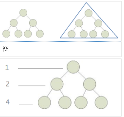
            满二叉树性质:  
            1. 满二叉树的第i层的节点数为2^(i-1)个
            2. 深度为k的满二叉树必有2^k - 1 个节点，叶子数为2^(k-1)
            3. 满二叉树中不存在度为1的节点，每一个分支点中都两颗深度相同的子树，且叶子节点都在最底层
            4. 具有n个节点的满二叉树的深度为log(n+1)
        - [完全二叉树](./complete_binary_tree)(Complete Binary Tree)：  
            对于深度为K的，有n个结点的二叉树，当且仅当其每一个结点都与深度为K的满二叉树中编号从1至n的结点一一对应时称之为完全二叉树;如果一棵二叉树是[满二叉树](./full_binary_tree), 则它必定是完全二叉树。
            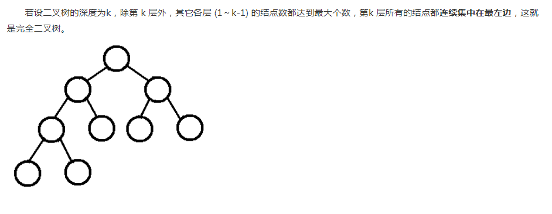
            性质：
            1. 具有n个结点的完全二叉树的深度[logk]+1
            2. 如果对一颗有n个结点的完全二叉树的结点按层序编号，则对任一结点i(1<=i<=n)
                - 如果i=1,则结点i是二叉树的根，如果i>1,则其双亲parent(i)是结点[i/2]
                - 如果2*i>n,则结点i无左孩子，否则其左孩子lchild(i)是结点2*i;
                - 如果2*i+1>n,则结点i无右孩子,否则其右孩子rchild(i)是结点2*i+1
            3. 叶子结点只能出现在最下层和次下层,且最下层的叶子结点集中在树的左部。
        - [二叉搜索树/二叉搜索树](./binary_search_tree)(Binary Search Tree)：  
            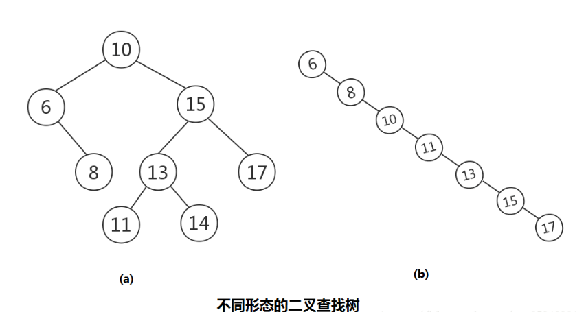
            它或是一颗空树，或者是具有下列性质的二叉树
            1. 若任意节点的左子树不空，则左子树上所有节点的值均小于它的根节点的值；
            2. 若任意节点的右子树不空，则右子树上所有节点的值均大于它的根节点的值；
            3. 任意节点的左、右子树也分别为二叉查找树；
            4. 没有键值相等的节点。
        - [平衡二叉搜索树](./avl_tree)(AVL Tree):
            它是一 棵空树或它的左右两个子树的高度差的绝对值不超过1，并且左右两个子树都是一棵平衡二叉树，同时，平衡二叉树必定是[二叉搜索树](./binary_search_tree)。
            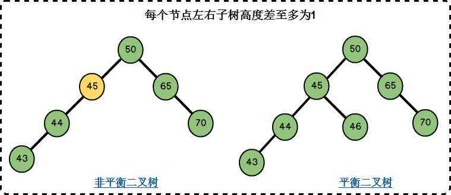
        - [伸展树/分裂树](./splay_tree)(Splay Tree):  
            伸展树是一种[二叉查找树](./binary_search_tree)，它能在O(logn)内完成插入、查找和删除操作。
            伸展树是一种自调整形式的[二叉查找树](./binary_search_tree)，它会沿着从某个节点到树根之间的路径，通过一系列的旋转把这个节点搬移到树根去。
            它的优势在于不需要记录用于平衡树的冗余信息。
            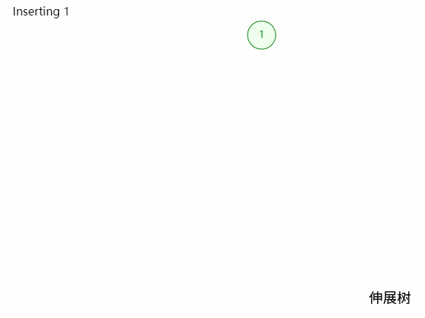
        - [线段树](./segment_tree)(Segment Tree):  
            线段树是一种[二叉搜索树](./binary_search_tree)，与区间树相似，它将一个区间划分成一些单元区间，每个单元区间对应线段树中的一个叶结点
            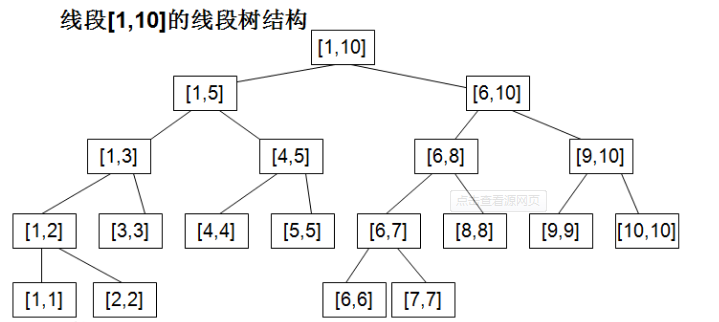
        - [红黑树](./red_black_tree)(Red-Black Tree):  
            红黑树是一颗特殊的[二叉查找树](./binary_search_tree)，除了[二叉查找树](./binary_search_tree)的要求外，它还具有以下特性：
            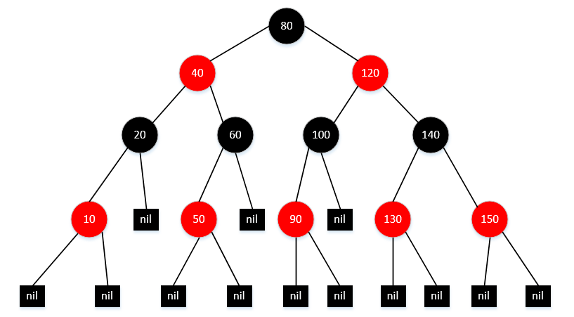
            1. 每个节点或者是黑色，或者是红色
            2. 根节点是黑色
            3. 每个叶子节点(NIL)是黑色[注意:这里叶子节点，是指为空（NIL 或NULL）的叶子节点]
            4. 如果一个节点是红色的，则它的子节点必须是黑色的
            5. 从一个节点到该节点的子孙节点的所有路径上包含相同数目的黑节点
        - [霍(哈)夫曼树](./huffman_tree)（最优二叉树 Huffman Tree）：  
            带权路径最短的二叉树称为哈夫曼树或最优二叉树
            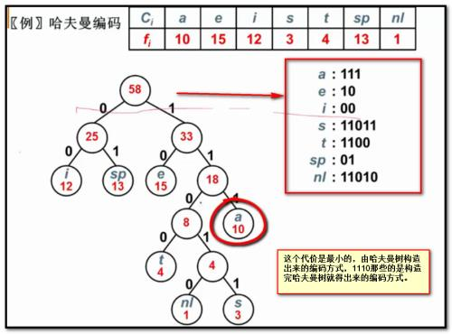
        - [字典树/前缀树](./trie_tree)(Trie Tree,Prefix Tree, 26-ary Tree):  
            Trie树，即字典树，又称单词查找树或键树，是一种树形结构，是一种哈希树的变种。  
            典型应用是用于统计和排序大量的字符串（但不仅限于字符串），所以经常被搜索引擎系统用于文本词频统计。  
            优点是：最大限度地减少无谓的字符串比较。  
            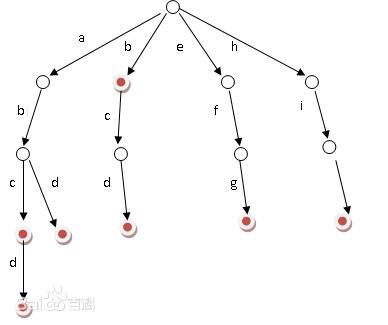  
            性质:  
            1. 根节点不包含字符，除根节点外每一个节点都只包含一个字符；
            2. 从根节点到某一节点，路径上经过的字符连接起来，为该节点对应的字符串；  
            3. 每个节点的所有子节点包含的字符都不相同
        - [基数树/压缩前缀树](./radix_tree)(Radix Tree,Compact Tree):  
            基数树，或称压缩前缀树，是一种更节省空间的Trie（前缀树）。  
            对于基数树的每个节点，如果该节点是确定的子树的话，就和父节点合并。  
            基数树可用来构建关联数组。 用于IP 路由。 信息检索中用于文本文档的倒排索引。
            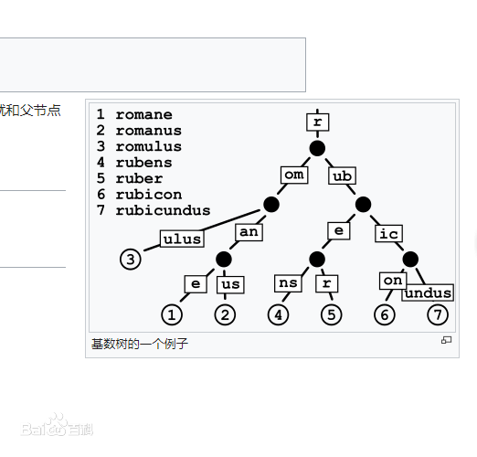
        - [三分搜索树](./ternary_search_tree)(Ternary Search Tree,Trie With BST Of Children):  
            三叉搜索树在计算机科学中是trie树或前缀树的一种实现，树的各个节点之间的结构类似二叉搜索树。  
            和其他的前缀树一样，三叉搜索树可以用于实现带前缀搜索功能的关联数组。  
            三叉搜索树比标准的前缀树更节省空间，但是牺牲了部分查找速度。  
            三叉搜索树常用于实现拼写检查和自动完成功能。  
            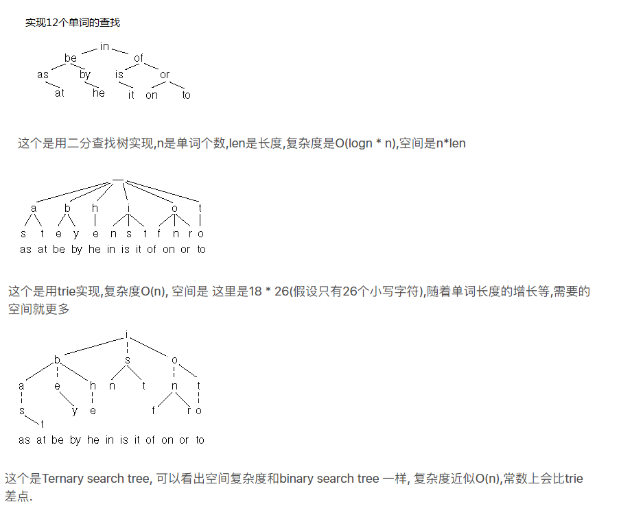
            `性质`:  
            三叉搜索树的每个节点存储了一个字符、一个值对象或值指针以及三个指向子节点的指针。这三个字节点常被称为等位子节点、低位子节点和高位子节点.
        - [B Tree](./b_tree)(Balance Tree 平衡多路搜索树):   
            B-Tree是为磁盘等外存储设备设计的一种平衡查找树。  
            B-Tree结构的数据可以让系统高效的找到数据所在的磁盘块。  
            为了描述B-Tree，首先定义一条记录为一个二元组[key, data] ，key为记录的键值，对应表中的主键值，data为一行记录中除主键外的数据。对于不同的记录，key值互不相同。
               
             一颗m阶B树的特性:
            1. 每个节点最多有m个孩子。 
            2. 除了根节点和叶子节点外，其它每个节点至少有Ceil(m/2)个孩子。 
            3. 若根节点不是叶子节点，则至少有2个孩子 
            4. 所有叶子节点都在同一层，且不包含其它关键字信息 
            5. 每个非终端节点包含n个关键字信息（P0,P1,…Pn, k1,…kn） 
            6. 关键字的个数n满足：ceil(m/2)-1 <= n <= m-1 
            7. ki(i=1,…n)为关键字，且关键字升序排序。 
            8. Pi(i=1,…n)为指向子树根节点的指针。P(i-1)指向的子树的所有节点关键字均小于ki，但都大于k(i-1)
            
        - [B+ Tree](./b+_tree):  
            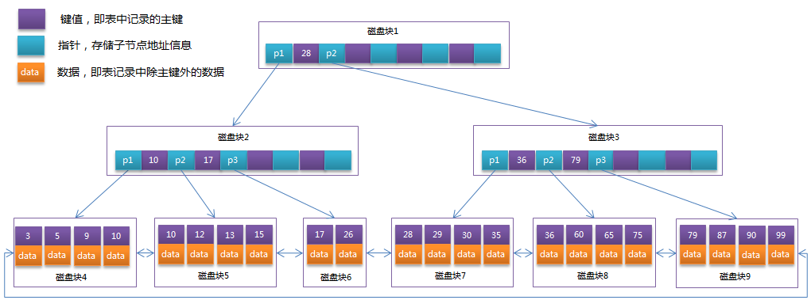  
            B+Tree相对于B-Tree有几点不同：
            1. 所有关键字都出现在叶子结点的链表中（稠密索引），且链表中的关键字恰好是有序的；
            2. 不可能在非叶子结点命中；
            3. 非叶子结点相当于是叶子结点的索引（稀疏索引），叶子结点相当于是存储（关键字）数据的数据层；
            4. 更适合文件索引系统；     
        - [B* Tree](./b_star_tree):  
            是B+树的变体，在B+树的非根和非叶子结点再增加指向兄弟的指针；
            B*树定义了非叶子结点关键字个数至少为(2/3)*M，即块的最低使用率为2/3（代替B+树的1/2）
            B*树分配新结点的概率比B+树要低，空间使用率更高
            
       
    - `深度`:
        定义一棵树的根结点层次为1，其他结点的层次是其父结点层次加1。一棵树中所有结点的层次的最大值称为这棵树的深度。
    - `表示方法`:
        - 图像表示法
        - 符号表达法
            用括号先将根结点放入一对圆括号中，然后把它的子树由左至右的顺序放入括号中，而对子树也采用同样的方法处理；同层子树与它的根结点用圆括号括起来，同层子树之间用逗号隔开，最后用闭括号括起来。如前文树形表示法可以表示为：（1（2（5（9，10）），3（6，7），4（8）））
        - 遍历表达法
            1. 先序遍历为ABDECF（根-左-右）
            2. 中序遍历为DBEAFC（左-根-右）（仅二叉树有中序遍历）
            3. 后序遍历为DEBFCA（左-右-根）
            4. 层次遍历为ABCDEF（同广度优先搜索）

- <i id="1"></i>**`存储结构`** 
对于存储结构,可能会联想到[顺序存储和链式存储结构](../0-define/linear_list#3)

